# The Onion Box
[](https://github.com/ralphwetzel/theonionbox/releases/latest)

[](https://github.com/ralphwetzel/theonionbox/blob/master/LICENSE)

[](https://pypi.org/project/theonionbox)


---
### The Onion Box v19: Preliminary documentation
## The ControlCenter

This latest version of The Onion Box introduces three changes of relevance:
* The current versioning scheme was dropped in preference for [Calendar Versioning](www.calver.org). Thus v19.2 will become the successor of v4.3.1.
* The Onion Box v19.2 and later requires Python 3.6 or Python 3.7. If you need to operate with Python2, you have to stay with The Onion Box v4.3.1.
* In addition to the well known (legacy) dashboard, suitable to monitor just a single Tor instance, The Onion Box now provides a ControlCenter mode to monitor a(ny) number of Tor nodes in parallel. That's how it looks like:

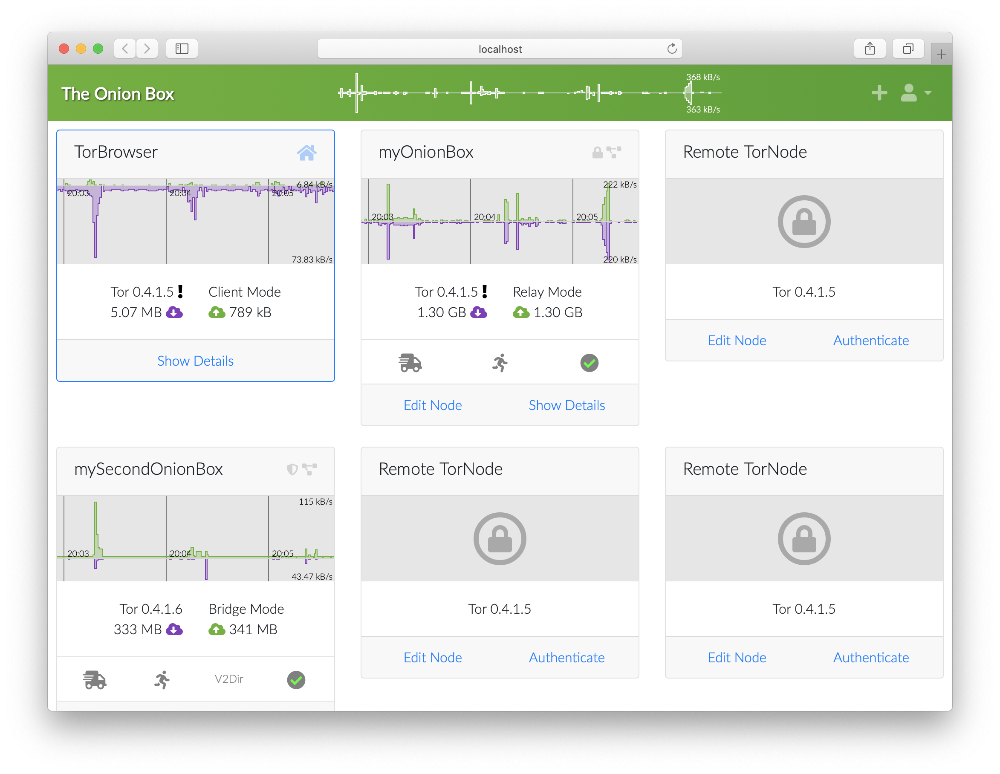

This is the shorttrack way to enable the ControlCenter mode:

1) Setup your Onion Box as you did before - and you'll get the legacy dashboard (as before).
2) Create a configuration file, that shall be used to store the configuration data of the ControlCenter. The easiest way to do this on a *nix-type system:
    ```
    (theonionbox) ~/theonionbox $ touch cc.cfg
    ```
    Please ensure write privileges for that file to the user running your Onion Box.
3) Tell your Onion Box where to find this configuration file - via the command line parameter `--controlcenter` or `-x`:

```
(theonionbox) ~/theonionbox $ theonionbox -x cc.cfg
```

4) Use the + - button in the upper right corner of the ControlCenter to add additional Tor nodes to be monitored.

5) The legacy dashboard with detail data for each node will show up if you follow the dedicated 'Show Details' link of each node.

6) To re-arrange the nodes in your ControlCenter, just Drag & Drop them around.

Enjoy!


---

_The Onion Box_ provides a web interface to monitor the operation of
a [Tor](https://www.torproject.org) node. It is able to monitor any Tor node operated as relay, as bridge and even as client - as long as it can establish a connection to the node and authenticate successfully.

The connection to the Tor node to be monitored may be established via a local `ControlSocket` or a `ControlPort` (local or remote). Advanced users may establish a connection via the Tor network to a node proving access to it's `ControlPort` by means of a Hidden Service - supporting on demand as well [Hidden Service Client Authorization](https://www.torproject.org/docs/tor-manual.html.en#HiddenServiceAuthorizeClient).

_The Onion Box_ supports whatever authentication method the Tor node provides.

A single instance of _The Onion Box_ is able to provide monitoring functionality for as many nodes as you like.

Above that, _The Onion Box_ is able to display Tor network status protocol data for any Tor node known by [Onionoo](https://metrics.torproject.org/onionoo.html).

[TOC levels=3 markdown bullet formatted hierarchy]: # "## Table of Contents"

## Table of Contents
- [The Web Interface](#the-web-interface)
    - [Header](#header)
    - [General Information](#general-information)
    - [Configuration](#configuration)
    - [Hidden Services](#hidden-services)
    - [Local Status](#local-status)
    - [Network Status](#network-status)
    - [Control Center](#control-center)
    - [Messages](#messages)
- [Getting Started](#getting-started)
    - [Scenario Assumption](#scenario-assumption)
    - [Supported environment](#supported-environment)
    - [System Preparation](#system-preparation)
    - [Installation](#installation)
    - [Verification of the installation](#verification-of-the-installation)
    - [First Flight](#first-flight)
    - [If it doesn't fly...](#if-it-doesnt-fly)
- [Dependencies](#dependencies)
- [Configuration by file](#configuration-by-file)
    - [Location](#location)
    - [Structure](#structure)
- [Command line parameters](#command-line-parameters)
    - [Deprecated parameters](#deprecated-parameters)
- [Advanced Operations: Authentication](#advanced-operations-authentication)
    - [Cookie Authentication](#cookie-authentication)
    - [Password Authentication](#password-authentication)
    - [No Authentication](#no-authentication)
- [Advanced Operations: Control Interface](#advanced-operations-control-interface)
    - [Caution](#caution)
    - [ControlSocket](#controlsocket)
    - [ControlPort](#controlport)
    - [ControlPort via Proxy](#controlport-via-proxy)
- [Hidden Service Operations](#hidden-service-operations)
    - [Basic configuration](#basic-configuration)
    - [Access control](#access-control)
- [_The Onion Box_ as system service (aka daemon)](#the-onion-box-as-system-service-aka-daemon)
    - [Logging to syslog](#logging-to-syslog)
    - [Optional syslog configuration](#optional-syslog-configuration)
    - [Prepared launcher scripts](#prepared-launcher-scripts)
    - [... on FreeBSD](#-on-freebsd)
    - [... using init.d](#-using-initd)
    - [... using systemd](#-using-systemd)
- [*The Onion Box* behind Apache's mod_proxy](#the-onion-box-behind-apaches-mod_proxy)
- [Usage Monitoring](#usage-monitoring)
- [Q&A](#qa)
    - [I receive a _Not supported proxy scheme socks5h_ warning. What shall I do?](#i-receive-a-not-supported-proxy-scheme-socks5h-warning-what-shall-i-do)
    - [I get a _Memory Error_ when trying to install via pip](#i-get-a-memory-error-when-trying-to-install-via-pip)
- [Shorttrack](#shorttrack)
- [Acknowledgments](#acknowledgments)


## The Web Interface
_The Onion Box_ generates a 'web page' that displays information regarding your Tor node. This information is split up into a number of sections. If a section is displayed and how the section looks like, depends on the data your box received from the Tor node monitored or knows about it from the Tor network status protocol. The web interface is generated on demand based on the latest data available.

> Tip: If a dedicated section is not displayed, just reload the page. Press `F5` or `command + R` to re-run the page creation process.

The following chapters introduce each available section and provide some further details to explain the content displayed:

---

### Header
The Header of the page shows some basic information about the Tor node monitored.


If you connected to this node via [password authentication](#password-authentication), you'll find a Logout Button in the upper right corner.

If your box discovers that there is an update of it's code available, a button in the upper left corner is displayed, providing access to some further information - and a link to GitHub.

------------------------------------------------------------------------------------------------------------------------------------------------------------------------------------------

### General Information
The section _Host | General Information_ displays information regarding the host system.

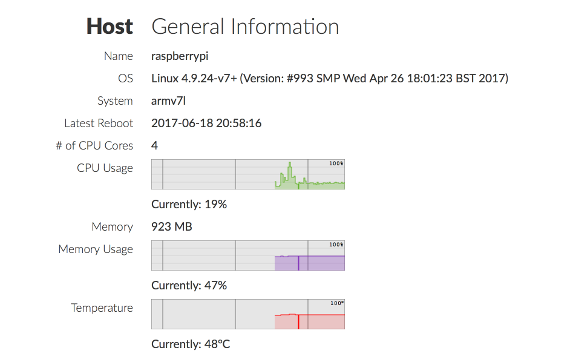

This section is only available if the box is running at the same physical device as the Tor node monitored.

_Latest Reboot_ as well as _Temperature_ are only available on supported operating systems.

If the host provides several CPU cores, you may click on the _CPU Usage_ chart to get a popup window displaying a seperate usage chart for each core.

---

### Configuration
The section _Tor | Configuration_ displays the configuration parameters of the Tor node monitored:

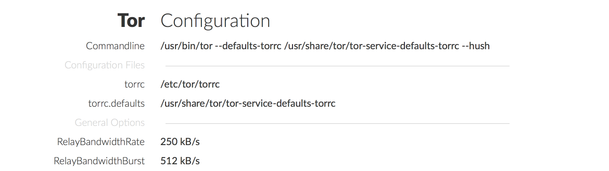

_Commandline_ lists the command line parameters used when launching the Tor node.

_Configuration Files_: A Tor node is configured by several sets of parameters. Those are Tor internal default settings, default settings defined in a configuration file referenced as _torrc.default_ (usually given by the Tor developers), user defined parameters (usually in a configuration file referenced as _torrc_) and finally parameters defined via the command line. The path to the two configuration files is indicated here.

The rest of this section displays all parameters that differ from the Tor internal default settings - except Hidden Service configuration settings (which are displayed in their own section).

If the curser hovers over the name of a configuration parameter, a hashtag is displayed providing a link to the Tor documentation. On mobile devices, you have to click on the name to make the hashtag appear.

There are some parameters that can be defined (e.g. via the command line), despite Tor doesn't signal back that those are set. The following table lists those parameters:

| Non-displayable Parameters |
|---|
| __OwningControllerProcess |

---

### Hidden Services
The section _Tor | Hidden Services_ displays the configuration parameters for the hidden service(s) of the Tor node monitored:

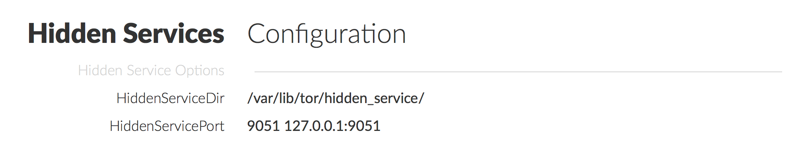

This section is only available if at least one hidden service is configured on this Tor node.

---

### Local Status
The section _Tor | Local Status_ displays information that the Tor node monitored knows about itself and its hosting environment.

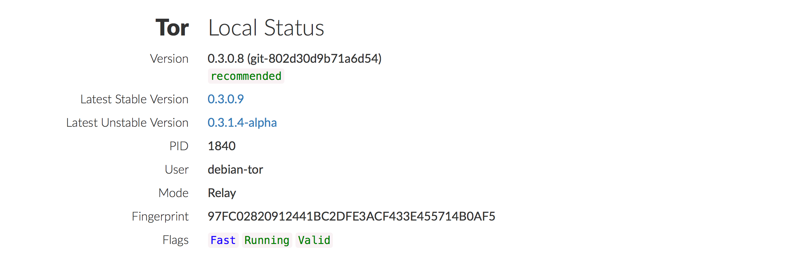

 ---

### Network Status
The section _Tor | Network Status_ displays information provided by [Onionoo](http://onionoo.torproject.org), the Tor network status protocol, concerning the Tor node monitored.


Those information are fetched regularly from Onionoo. If not available (which could happen when you connect to a node for the first time or when operating via slow connections), you will be asked to reload the page.

Only portions of this section are available if the Tor node monitored is operated as a bridge.

_Location_ by default provides the information Onionoo knows about the location of the Tor node & shows the location on a map.

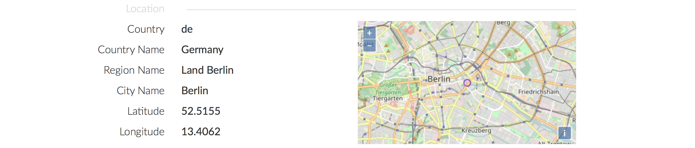

By special configuration you can advise the box to query the location of the IP address of the Tor node monitored from a user provided GeoIP City DB.

_Bandwidth_ displays the bandwidth history data as known to Onionoo.

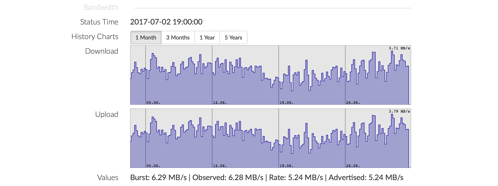

The number of available charts depends on the age of the Tor node monitored. You may switch the chart displayed via the _History Charts_ buttons.

_Weights_ displays the weights history data as known to Onionoo.

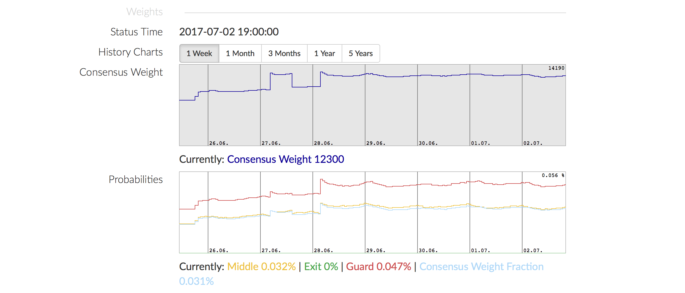

The number of available charts depends on the age of the Tor node monitored. You may switch the chart displayed via the _History Charts_ buttons.

---
### Control Center
~~Do you intend to monitor more than one Tor node? Are you interested in the Oninooo data of other Tor nodes? The section _Box | Control Center_ provides that functionality.~~


#### Search
~~Enter a search phrase - which should be a (part of a) nickname of a Tor node or a (portion of a) fingerprint - into the _Search_ field and press enter. This search phrase will be used to query Onionoo - and the result presented in a popup bubble. If the search was successful, you may click on the links provided to display the Tor network status protocol data of that Tor node.~~

#### Controlled Hosts
~~If you provided access control information for additional Tor nodes in the configuration file of your box, those nodes are listed under _Controlled Hosts_. Click on the fingerprint and you will be connected to that Tor node.~~

---

### Messages
The section _Box | Messages_ displays the messages received from the Tor node(s) monitored and from your box.

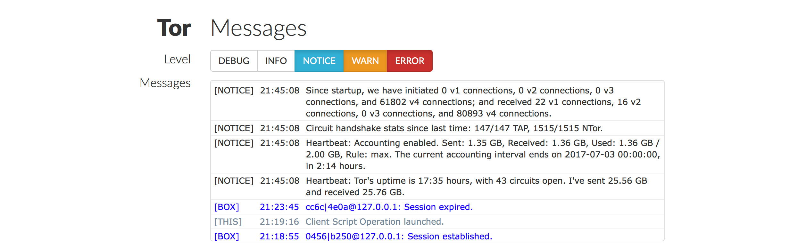

You can alter the noisiness of the Tor node monitored by mean of the _Level_ selector buttons. Be advised that it takes some seconds to forward a message level change to the node.
> By default, _INFO_ and _DEBUG_ level messages are not forwarded to the monitoring application. _INFO_ is babblative - and _DEBUG_ even more. Both levels create a lot of traffic. Use those settings with caution!

This section is only available for controlled nodes.

> The message system of _The Onion Box_ cannot be manipulated via the web interface. If you are interested in receiving _DEBUG_ or _TRACE_ message from your box, you have to set the appropriate [command line](#command-line-parameters) parameter.

---

## Getting Started
This chapter leads you through the installation procedure of you own _Onion Box_.  
The level of detail provided here should allow everyone, being a Novice or an Expert in the world of Tor, to successfully set up his personal box. If you encountered any issues - due to whichever reason - drop me a line and I will try to improve this description to meet your demands.

### Scenario Assumption
For the following tutorial I will assume a quite common scenario, the intension to install _The Onion Box_ on a Raspberry Pi with Raspbian running a Tor node. This makes it easier to explain the procedures given a precise use case rather than elaborating through all potentional
shoulds and coulds.
> If you encounter a situation that is significantly different from this scenario, let's discuss how to amend the description to cover those specialities.

So we assume that you're logged in as user **pi**, operating on the **PIXEL** desktop (which is the default Raspbian desktop). Your starting point should look like this:

<p  align="center"></p>

### Supported environment
_The Onion Box_ is a Python application, developed with v2.7 and v3.6.

By default, it should operate successfully on every platform providing Python support. Confirmation can be given that it works properly in following environments:
- Bananian | [Jessie](https://github.com/ralphwetzel/theonionbox/issues/7#issuecomment-346902660)
- Debian | Jessie
- FreeBSD
- macOS | Darwin
- Raspbian | Jessie, Stretch
- Ubuntu 16.04
- Windows 10

The Python version you are operating with (per default), can be verifyed via a terminal / command line by the issuing `python --version`:
```
~ $ python --version
python 2.7.9
```
As said, this displays the version of the _default_ Python interpreter. Explicitely you may use as well `python2 --version` or `python3 --version` to ask for the version numbers of the dedicated releases.

_The Onion Box_ is designed to run with either Python > 2.7.9 or Python > 3.6. If _none_ of your Python versions fit these reqirements, check [the Python page](http://www.python.org) for procedures how to upgrade your installation. On a Linux system, you could e.g. run `apt-get` like
```
~ $ sudo apt-get install --upgrade python
~ $ sudo apt-get install --upgrade python3
```
to install the latest versions available in the repositories.

### System Preparation
#### sudo
There is a prerequisite you should check prior to anything else: Is your `sudo` setup working? Is `sudo` installed and has your account adequate `sudo` privileges?

To verify those aspects, open a terminal and just type `sudo`:
```
~ $ sudo
usage: sudo -h | -K | -k | -V
usage: sudo -v [-AknS] [-g group] [-h host] [-p prompt] [-u user]
usage: sudo -l [-AknS] [-g group] [-h host] [-p prompt] [-U user] [-u user]
            [command]
usage: sudo [-AbEHknPS] [-r role] [-t type] [-C num] [-g group] [-h host] [-p
            prompt] [-u user] [VAR=value] [-i|-s] [<command>]
usage: sudo -e [-AknS] [-r role] [-t type] [-C num] [-g group] [-h host] [-p
            prompt] [-u user] file ...
~ $ 
```
If `sudo` is installed, it should answer with it's help message.  
If not, you need an **account with root privileges** to install it:
```
root@raspberrypi:/# apt-get install sudo
```
The `sudo` system grants `sudo` rights to the members of the group `sudo`. To verify this for your current account, use the `getent` command. Working with user `pi`, you would issue a
```
~ $ getent group | grep pi
[...]
cdrom:x:24:pi
sudo:x:27:pi
audio:x:29:pi
video:x:44:pi
[...]
```
The line
```
sudo:x:27:pi
```
tells you that `pi` is member of the `sudo` group.  
If you don't get such a feedback, you have to grant your account membership of this group. Again, you need an **account with root privileges**:
```
root@raspberrypi:/# usermod -g sudo pi
```
> Alternatively you could log in with another account who already has sudo privileges to issue a `sudo usermod -g sudo pi`.

For verification, use again the `getent` command!
```
~ $ getent group | grep pi
[...]
cdrom:x:24:pi
sudo:x:27:pi
audio:x:29:pi
video:x:44:pi
[...]
```

#### virtualenv
I strongly recommend to run _The Onion Box_ in a [Python Virtual Environment](https://docs.python.org/3/tutorial/venv.html) . The additional effort is (almost) zero - yet you gain certainty that the environment is and stays perfect for operating your box:

Open a terminal and start your system preparation by installing the Python _virtualenv_ package:
```
~ $ sudo pip install virtualenv
Collecting virtualenv
  Using cached virtualenv-15.1.0-py2.py3-none-any.whl
Installing collected packages: virtualenv
Successfully installed virtualenv-15.1.0
```
After this successfully completed, create the virtual environment for your box in a dedicated directory, e.g. `./theonionbox`:
> There is no need to exactly use `theonionbox` as the name for the directory to create the virtual environment in; thus choose whatever you like yet ensure that it is a valid directory name and not pre-occupied.
```
~ $ virtualenv theonionbox
New python executable in /home/pi/theonionbox/bin/python
Installing setuptools, pip, wheel...done.
```
To verify the installation, change into the directory created (`cd theonionbox`) and list its content with `ls -l`:
```
~ $ cd theonionbox
~/theonionbox $ ls -l
total 20
drwxr-xr-x 2 pi pi 4096 Jan 18 19:21 bin
drwxr-xr-x 2 pi pi 4096 Jan 18 19:21 include
drwxr-xr-x 3 pi pi 4096 Jan 18 19:21 lib
-rw-r--r-- 1 pi pi   60 Jan 18 19:21 pip-selfcheck.json
~/theonionbox $
```
If your's looks equivalent, you've successfully created this virtual environment.
> There might be an additional folder named `local` if you operate your virtual environment with Python 2.7.

As final step, activate the environment now:
```
~/theonionbox $ source bin/activate
(theonionbox) ~/theonionbox $ 
```
> On a Windows system, use `Scripts\activate` to activate the virtual environment. You may as well refer to the [documentation of _virtualenv_](https://virtualenv.pypa.io/en/stable/userguide/) if you encounter any issues, e.g. if using _Powershell_.

> The fact that the virtual environment is activated is indicated by the name of the virtualenv in parentheses preceding the path info, e.g. here via `(theonionbox)`.

> If you're working with the `csh` or `fish` shell, you have to use a dedicated file / command to activate the virtual environment:  
For `csh`, use `source bin/activate.csh`  
For `fish`, use `source bin/activate.fish`

To **later** close the Virtual Environment, issue a `deactivate` command:
```
(theonionbox) ~/theonionbox $ deactivate
~/theonionbox $ 
```

### Installation
The latest release package of [_The Onion Box_](https://testpypi.python.org/pypi/theonionbox/) is always available in [PyPi](https://testpypi.python.org), the Python Package Index. You can download and install it with `pip install theonionbox`. Please ensure, that you're doing this within the virtual environment created for your box; (re-)activate it if necessary with:
```
~/theonionbox $ source bin/activate
(theonionbox) ~/theonionbox $ pip install theonionbox
```
Along with the files for _The Onion Box_, all additional [dependencies](#dependencies) will be installed into the virtual environment you created. No changes will be made to _The World Outside_ and there is no need to operate this `pip` command as `root`.
> Be aware that it might need some minutes to download and compile the requested packages and all their dependencies.

Please ensure that the installation process is performed without any error. You should read a line like
```
[...]
Successfully installed PySocks-1.6.8 apscheduler-2.1.2 bottle-0.12.13 certifi-2017.11.5 [...]
(theonionbox) ~/theonionbox $
```
as the final message.

### Verification of the installation
To verify this `pip`ed installation, list (`ls -l`) the files in the directory of your virtual environment again, now:
```
(theonionbox) ~/theonionbox $ ls -l
total 668
drwxr-xr-x 2 pi pi   4096 Jan 18 19:37 bin
drwxr-xr-x 2 pi pi   4096 Jan 18 19:37 config
drwxr-xr-x 3 pi pi   4096 Jan 18 19:37 docs
drwxr-xr-x 2 pi pi   4096 Jan 18 19:21 include
drwxr-xr-x 3 pi pi   4096 Jan 18 19:21 lib
-rw-r--r-- 1 pi pi     60 Jan 18 19:21 pip-selfcheck.json
-rw-r--r-- 1 pi pi 650924 Jan 18 19:37 README.html
drwxr-xr-x 5 pi pi   4096 Jan 18 19:37 service
(theonionbox) ~/theonionbox $ 
```
> As already mentioned, there might be an additional folder named `local` if you operate your virtual environment with Python 2.7.

First finding: This file, `README.html`, was placed into the root of your virtual environment - to always be at your hand if necessary.

Second finding! There were three additional subdirectories created:
* `config`, where to place a [configuration file](#configuration-by-file) - if you need one. You'll find there as well an example for such a configuration file.
* `docs`, that holds the images used in this document.
* `service`, to provide the launchers if you intend to run your box as a [system service / daemon](#the-onion-box-as-system-service-aka-daemon).

The Python packages - for the box and all it's dependencies - are located in `lib/python2.7/site-packages/`. Be aware, that the `python` path segment might be different (e.g. `lib/python3.6/site-packages/`) if your virtual environment operates with another version of Python!
_The Box Launcher_ (named as well `theonionbox`) is located in `bin/`, next to the executables of the Python version used in your virtual environment.

If the structure of your installation looks equivalent, your box is now cleared for takeoff!

### First Flight
Type `theonionbox` to launch your box for the first time:
```
(theonionbox) ~/theonionbox $ theonionbox
```
Your box will perform some steps to initialize and then wait for connections at `http://127.0.0.1:8080`. A typical startup sequence of a fresh installation of _The Onion Box_ looks like this:

```
16:09:07.688 The Onion Box: WebInterface to monitor Tor node operations.
16:09:07.692 Version v4.x (stamp 2018....|15....)
16:09:07.693 Running on a Linux host.
16:09:07.695 Running with permissions of user 'pi'.
16:09:07.696 Python version is 2.7.13 (/home/pi/theonionbox/bin/python).
16:09:07.697 This seems to be a Python VirtualEnv.
16:09:07.728 No (valid) configuration file found; operating with default settings.
16:09:11.471 Temperature sensor information located in file system. Expect to get a chart!
16:09:11.473 Uptime information located. Expect to get a readout!
16:09:12.077 Ready to listen on http://127.0.0.1:8080/
16:09:12.153 Press Ctrl-C to quit!
```

At that stage, open a webbrowser from the PIXEL desktop and connect to your box at the given address (here: `http://127.0.0.1:8080`).  

It is yet very likely, that you'll receive an error message like this one:
<p  align="center">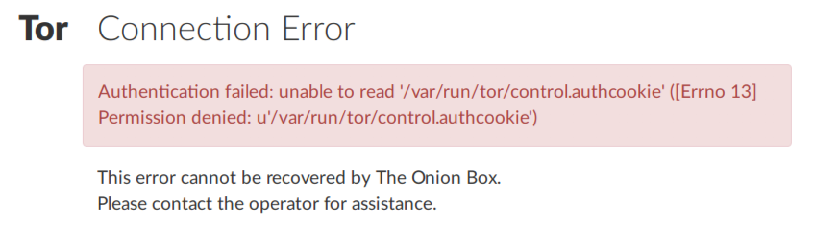</p>

Don't be disappointed! As your box explained during it's launch procedure, it is
```
16:09:07.695 Running with permissions of user 'pi'.
```
Very likely your Tor node yet was (e.g. by default) configured to guard the access to it's `ControlPort` by `CookieAuthentication`. As user `pi` (in common scenarios) has no permission to read this cookie, your box fails to authenticate against your Tor node - and has to issue a Connection Error.
To compensate for that error and to comply with the Tor configuration setting, just launch your box with the same user that owns & controls your Tor node - which on Debian like systems usually is `debian-tor`:

> Remember: To stop the operation of your box, press `Ctrl-C`!
```
(theonionbox) ~/theonionbox $ sudo -u debian-tor ./bin/theonionbox
```
> Please note that you now have to state the full path - either relative or absolute - to [_The Box Launcher_](#verification-of-the-installation) script (`theonionbox`) to run the box! For our scenario, I've chosen to use the relative path of `./bin/theonionbox`!

```
[...]
16:33:16.543 Running on a Linux host.
16:33:16.544 Running with permissions of user 'debian-tor'.
16:33:16.544 Python version is 2.7.13 (/home/pi/theonionbox/bin/python).
16:33:16.566 No (valid) configuration file found; operating with default settings.
16:33:20.314 Temperature sensor information located in file system. Expect to get a chart!
16:33:20.315 Uptime information located. Expect to get a readout!
[...]
```
> You might notice as well, that _The Onion Box_ is now unable to detect that it's running inside a virtual environment! This is technically correct, as issueing the `sudo -u` command breaks those boundaries. Be assured, that this is ok!

As before, browse now to `http://127.0.0.1:8080` ... and enjoy monitoring your Tor node!

### If it doesn't fly...
There have been issues reported that the box is unable to connect to the [ControlPort](#controlport) of your Tor node even when started using the `sudo -u` command. The reasons for this might be obscure - the solution is straight forward: Add the user you're operating with to the same group that owns the Tor node process.

Start this procedure by querying for the Tor node process with `ps -aux | grep tor`:
```
~ $ ps -aux | grep tor
root       112  0.0  0.0      0     0 ?        S    Jan28   0:38 [usb-storage]
debian-+   692 21.7 18.0 216520 171668 ?       Ssl  Jan28 1240:02 /usr/bin/tor --defaults-torrc /usr/share/tor/tor-service-defaults-torrc -f /etc/tor/torrc --RunAsDaemon 0
pi         697  0.0  1.1  74696 10684 ?        Ssl  Jan28   0:00 /usr/lib/gvfs/gvfs-udisks2-volume-monitor
[...]
~ $
```
The line
```
debian-+   692 21.7 18.0 216520 171668 ?       Ssl  Jan28 1240:02 /usr/bin/tor --defaults-torrc /usr/share/tor/tor-service-defaults-torrc -f /etc/tor/torrc --RunAsDaemon 0
```
tells you that the process ID (PID) of the Tor node (`/usr/bin/tor`) is _692_ and that the user owning it starts with `debian-` - yet, as the `+` indicates, the name is truncated.

If necessary - to get the full name - issue then a `ps -o user= -p <PIDHERE>`:
```
~ $ ps -o user= -p 692
debian-tor
~ $
```
Next - check which group this user belongs to:
```
~ $ groups debian-tor
debian-tor : debian-tor
~ $
```
As a final step, add now your current user (which is `pi` in our scenario) to that group (indicated as `debian-tor`):
```
~ $ sudo usermod -a -G debian-tor pi
~ $
```
Verification:
```
~ $ groups pi
pi : pi [...] debian-tor
~ $
```
That achieved, you should be able to smoothly [run your box](#first-flight) now - and get no Connection Error.

## Dependencies
_The Onion Box_ depends on some libraries developed and provided by third parties. If you follow the [installation procedure](#installation) , `pip` will care to install all necessary packages for you.  
If you perform a non-`pip` (manual) installation (e.g. directly from the GitHub repository), you have to ensure that those dependencies are installed accordingly:

* [psutil](https://pypi.python.org/pypi/psutil)
* [stem](https://pypi.python.org/pypi/stem)
* [bottle](https://pypi.python.org/pypi/bottle)
* [APScheduler](https://pypi.python.org/pypi/apscheduler)
* [PySocks](https://pypi.python.org/pypi/PySocks)
* [tzlocal](https://pypi.python.org/pypi/tzlocal)

To operate a box in an Python 2.7 environment, you need as well the [futures](https://pypi.python.org/pypi/futures/) module.

If you intend to use the advanced GeoIP2 functionality, you have to install as well the module [geoip2](https://pypi.python.org/pypi/geoip2).

If you intend to operate _The Onion Box_ in SSL mode, you have to install as well the module [ssl](https://pypi.python.org/pypi/ssl).


These modules are usually installed using `pip`, e.g.: `pip install psutil`

Please use always the ~~latest~~ version ~~available~~ demanded for your Python release. Remember that you (usually) need to have root privileges to operate `pip`, e.g. `sudo -u pip install psutil`.  
My advice is yet to always operate within a [Python Virtual Environment](#system-preparation) - which eliminates the demand to run `pip` with root privileges.

> Check this [Q&A](#i-receive-a-not-supported-proxy-scheme-socks5h-warning-what-shall-i-do) if your `pip` installation is broken or if you receive a `socks5h proxy not supported` warning.

## Configuration by file

By design, _The Onion Box_ is able to detect a typical local Tor node installation and will connect without further preparation.

Therefore no configuration be necessary - if you are operating your node at `ControlPort 9051` (which is the default for a relay) or `ControlPort 9151` (the default for TorBrowser).

For all other situations, you may configure the way of operation of your box via a configuration file.

### Location
If you do not provide a dedicated `--config=<path>` to define the path to a configuration file via the [command line](#command-line-parameters), _The Onion Box_ checks for availability of a file named `theonionbox.cfg` at one of the following locations (in the given order):
* if launched from a Python Virtual Environment, in a directory named `config` below the root directory of the virtual environment: `$VIRTUAL_ENV/config/theonionbox.cfg`
* in the same directory as `theonionbox.py`: `./theonionbox.cfg`
* in a directory named `config` below the directory of `theonionbox.py`: `./config/theonionbox.cfg`

If you've saved your configuration file at one of those locations, yet your box still states `No (valid) configuration file found.`, you might use the [-d command line parameter](#command-line-parameters) to enable the _Debug_ mode. This will trigger _The Onion Box_ to emit the absolute search paths it's checking for the configuration files:

```
(theonionbox) ~/theonionbox $ theonionbox -d
        17:57:10.551 The Onion Box: WebInterface to monitor Tor node operations.
[...]
[DEBUG] 17:57:10.590 theonionbox.py[391]: No configuration file found at '/home/pi/theonionbox/config/theonionbox.cfg'
[DEBUG] 17:57:10.594 theonionbox.py[391]: No configuration file found at '/home/pi/theonionbox/lib/python2.7/site-packages/theonionbox/theonionbox.cfg'
[DEBUG] 17:57:10.596 theonionbox.py[391]: No configuration file found at '/home/pi/theonionbox/lib/python2.7/site-packages/theonionbox/config/theonionbox.cfg'
```

### Structure
The configuration file of _The Onion Box_ is a simple text file "ini-style". A template of that file is available as [`./config/theonionbox.example`](./theonionbox/config/theonionbox.example) in the directory of `theonionbox.py`.

#### Section `[config]`
```
[config]
## v4.0 will only support version = 2
protocol = 2
```
_The Onion Box_ as of version 4 only supports configuration file protocol `2`.

#### Section `[TheOnionBox]`
```
[TheOnionBox]
## Address of your Onion Box:
## This defaults to 127.0.0.1 to listen *only* on the local loopback interface.
# host = 127.0.0.1
## If 'localhost', connections are limited to the local system.
# host = localhost
## Of course you may define a dedicated IP4 address as well.
# host = your.IP.4.address

## Port for the Web Server
## Defaults to 8080, which should be fine in most cases!
# port = 8080

## To define the lower threshold for the notification system:
## Messages (of the Box) with at least this level will be forwarded to the attached clients.
## Possible setting are DEBUG, INFO, NOTICE, WARNING, ERROR
## Defaults to NOTICE, case insensitive
## To 'DEBUG' or 'TRACE' the box you have to set the respective commandline parameters!
# message_level = NOTICE

## Per default, the Box operates at the root level of a domain e.g. http://localhost:8080/.
## If you intend to operate it (behind a proxy!) at a deeper level (e.g. @ http://my.server.com/theonionbox/)
## you have to define that base path here. You are not limited to a single path element.
## Please assure that this is an absolute filepath yet without the domain:port, beginning with a leading slash,
## no trailing slash, no quotation marks:
# base_path = /theonionbox

## The acceptable duration in seconds between two communication events of a client to the Box.
## If this duration is exceeded, the Box will expire the session. Default is 300 (seconds).
# session_ttl = 300
## Note: This is applicable for login procedures as well as monitoring activities.
## Note: The minimum duration accepted == 30, max == 3600. Values will be forced into that range.

## Shall we operate with SSL?
## Note: To actually make this running, you have to create a valid ssl certificate first:
## So run e.g.
## openssl req -new -x509 -keyout server.pem -out server.pem -days 365 -nodes
##
## DON'T distribute this combined private/public key to clients!
## (see http://www.piware.de/2011/01/creating-an-https-server-in-python/#comment-11380)
##
## ssl = yes    # deprecated 20170218
## Just set ssl_certificate & ssl_key to enable ssl mode!
## The file that holds the Certificate!
# ssl_certificate = server.pem
## The file that holds the Key!
# ssl_key = private_key.pem

## When a NTP server is provided
## we use it's time signal to compensate for the server's clock deviations
# ntp_server = pool.ntp.org
# ntp_server = fritz.box

## Path to store the database file for persistance of e.g. bandwidth data.
## Defaults to a system defined temporary directory.
# persistance_dir = /home/pi/theonionbox
## Be aware, that you have to assure write privileges to this directory for the user running your box.

## Tor ships with the GeoIPLight2 Country DB
## If you're interested in a more precise indication, you should install the GeoIP City DB
## e.g. from http://dev.maxmind.com/geoip/geoip2/geolite2/ and define here the path to the db file.
## Both flavours (Full or Light) are supported.
# geoip2_city = path/to/geoip2/city/db.mmdb
## Be aware that you need to install python module 'geoip2' as well to access those information.
```

#### Section `[Tor]`
These are the parameters to connect and authenticate to your "primary" (or first or main) Tor node to be monitored.
```
[Tor]
## How shall we establish the connection to your primary (controlled) Tor node?
## => via a ControlSocket (define additionally 'socket' parameter):
# control = socket
## => via a ControlPort (define additionally 'host' & 'port' parameter):
# control = port
## => via a Proxy (define a proxy via the [Proxy] section and set 'host' to an address reachable through this proxy):
# control = proxy
## Note: This defaults to control = port if not defined!

## Address of this Tor instance
## Do NOT use 'localhost' but 127.0.0.1 to connect locally
## Defaults to 127.0.0.1
# host = 127.0.0.1

## ControlPort of this Tor instance
## Default for a Relay (or Bridge)
# port = 9051
## Default for a TorBrowser
# port = 9151
## You may use 'default' (port = default) to test for 9051 (relay default) and 9151 (browser default)
# port = default
## Note: This defaults to port = default if not defined!

## ControlSocket of this Tor instance
# socket = /var/run/tor/control

## Timeout when connecting to Tor.
## Usually the connection should be established very quick;
## you may increase this if connecting to very remote systems.
# timeout = 5

## The Number of Seconds we keep the connection to
## Tor open after the last user disconnected.
## Hint: The minimum reasonable TTL is > 30(s)
## Defaults to 30 (seconds)
## eg. 1 day
# ttl = 86400
## eg. 1 hour
# ttl = 3600
## eg. forever
# ttl = -1

## Switches to preserve the messages of the Relay
## Up to 400 messages (total) will be preserved
## The severity of these messages can be defined here
## There's one switch for ERR, WARN & NOTICE
## The default setting is 'on' for all of these
## There's NO switch for INFO & DEBUG (as this would flood the memory without true value)
## Live - transmission of messages can be switched on/off in the client
# tor_preserve_ERR = no
# tor_preserve_WARN = no
# tor_preserve_NOTICE = no
```

#### Section `[TorProxy]`
```
[TorProxy]
## Note: Operation via a proxy given by a unix domain socket is (as of 04/2017) not supported!

## If you establish connection cookies for hosts to be controlled via the control center, there is the need
## to verify that those cookies are defined. To perform the verification, we need valid control port
## settings of the node acting as proxy:
## How shall we establish the connection to the node?
## => via a ControlSocket (define additionally 'socket' parameter):
# control = socket
## => via a ControlPort (define additionally 'port' parameter):
# control = port
## You may use control = default to operate with [Tor]control
## Note: This defaults to control = default if not defined!

## Address of the proxy to use
## Do NOT use 'localhost' but 127.0.0.1 to connect locally
## You may use 'default' (host = default) to use [Tor]host
# host = default
# host = 127.0.0.1
## Note: This defaults to host = default if not defined!

## Port for the proxy
## Default for a Relay (or Bridge)
# proxy = 9050
## Default for a Tor Browser
# proxy = 9150
## You may use 'default' (proxy = default) to test for 9050 (relay default) and 9150 (browser default)
# proxy = default
## Note: This defaults to proxy = default if not defined!

## ControlPort of the proxy Tor node
## Default for a Relay (or Bridge)
# port = 9051
## Default for a Tor Browser
# port = 9151
## You may use 'default' (port = default) to test for 9050 (relay default) and 9150 (browser default)
# port = default
## Note: This defaults to port = default if not defined!

## ControlSocket of the proxy Tor node
# socket = /var/run/tor/control
## You may use 'default' (socket = default) to use [Tor]socket
# socket = default
## Note: This defaults to socket = default if not defined!
```

#### One dedicated section for each additional _Controlled Host_
For each Tor node you intend to monitor - **but not** for the  "primary" node configured already in section `[Tor]` - you have to add a dedicated section proving the access data for its `ControlPort`.

> You must not name any of the following sections 'config', 'TheOnionBox', 'Tor' or 'TorProxy'.

```
#####
## Those are the Tor nodes to be controlled with the control center
## Note: You must not name any of the following sections 'config', 'TheOnionBox', 'Tor' or 'TorProxy'.


## Define one section per node:
# [myControlledNode]

## Alternatively: Beginning the section identifier with '#' indicates a nickname;
## if you later omit the 'nick' parameter, the nickname will be derived from the section identifier.
# [#myControlledNode]
## If you intend to define several ways to connect to this node,
## add whatever you like after a ':' to distinguish the sections:
# [#myControlledNode:2]

## Alternatively: You can use the fingerprint (with preceding '$') as section identifier.
## Ensure a length of 41 characters: '$' + fingerprint[40];
## if you later omit the 'fp' parameter, the fingerprint will be derived from the section identifier.
# [$5COOL5C30AXX4B3DE460815323967087ZZ53D947]
## If you intend to define several ways to connect to this node,
## add whatever you like after a ':' to distinguish the sections:
# [$5COOL5C30AXX4B3DE460815323967087ZZ53D947:2]


## How shall we establish the connection to this node?
## => via a ControlSocket (define additionally 'socket' parameter):
# control = socket
## => via a ControlPort (define additionally 'host' & 'port' parameter):
# control = port
## => via a Proxy (define a proxy via the [Proxy] section and set 'host' to an address reachable through this proxy):
# control = proxy
## Note: There is no default setting. If not defined, this section (and thus the node) will be ignored.

## IP Address of this Tor node
# host = 127.0.0.1
## You may as well define an onion or http address
# host = takeonionaddress.onion
## Note: There is no default setting.

## ControlPort of this Tor node
## Default for a Relay (or Bridge)
# port = 9051
## Note: There is no default setting.

## This is only relevant for very rare setups - yet if you like, you may use it!
## ControlSocket of this Tor node
# socket = /var/run/tor/control
## Note: There is no default setting.

## Hidden Service connections my be secured by definition of a authorization cookie.
## To operate via those connections, you may define this cookie here.
## For further details refer to 'HiddenServiceAuthorizeClient' on https://www.torproject.org/docs/tor-manual.html
# cookie = xuseyourcookieherexTOB
## The Box will ensure that the cookie is registered before establishing the connection.
## Note: There is no default setting.

## The nickname of this node
# nick = myControlledNode
## Defining a nickname here overrides a nickname defined as the name of the section.
## Note: The Box is able to retrieve the nickname itself,
##       yet defining nickname (and fingerprint) parameters saves onionoo queries.
## Note: There is no default setting.

## The fingerprint of this node
# fp = $5COOL5C30AXX4B3DE460815323967087ZZ53D947
## Defining a fingerprint here overrides a fingerprint defined as the name of the section.
## Note: The Box is able to retrieve the fingerprint itself,
##       yet defining fingerprint (and nickname) parameters saves onionoo queries.
## Note: There is no default setting.
```

## Command line parameters
_The Onion Box_ may be configured by a small number of commandline parameters:

```
-c <path> | --config=<path>: Provide path & name of configuration file.
                             Note: This is only necessary when NOT using
                             './theonionbox.cfg' or './config/theonionbox.cfg'.
-d | --debug: Switch on DEBUG mode.
-t | --trace: Switch on TRACE mode (which is more verbose than DEBUG mode).
-h | --help: Prints this information.
-l <directory> | --log=<directory>: Define directory to additionally
                                    emit log messages to. Please assure
                                    correct access privileges!

```

`DEBUG` mode only affects the _Box_' core code. It forwards the debug messages of _The Onion Box_ to the console or the log file. If you encounter any problems, you may enable `DEBUG` mode to check what's happing.

`TRACE` additionally forwards debug level messages of `bottle` (the WSGI micro web-framework used by the _Box_) and trace level messages of `stem` (the Tor controller library). This mode is really noisy ... and the ultimate lever to follow the operation of _The Onion Box_ in case of problems.

### Deprecated parameters
Prior to version 4.1.3 you had to define the command line parameter
```
-m <mode> | --mode=<mode>
```
to `Configure The Box to run as 'service'`. This parameter meanwhile is obsolete. Using `-m` or `--mode` will trigger a `DeprecationWarning`.


## Advanced Operations: Authentication
Monitoring a Tor node in the end just demands two prerequisites: Access to an interface to control the node and a way to authenticate against the node. Therefore _Advanced Operations_ is all about the different ways to provide a [control interface](#advanced-operations-control-interface) and the different ways of **authentication**.

To clarify one topic upfront: You don't need to tell your box the way of authentication it shall use. This topic will transparently be negotiated between the Tor node and the _Box_.

### Cookie Authentication
By default (defined in the configuration file [`torrc.default`](#configuration)) a Tor node offers _Cookie Authentication_ as standard authentication method.  

According to the Tor manual, when using _Cookie Authentication_, the Tor node allows "connections on the control port when the connecting process knows the contents of a file named `control_auth_cookie`, which Tor will create in its data directory".  
This implies that _Cookie Authentication_ can only be used locally - which means that this authentication method is only suitable if you have installed _The Onion Box_ on the same system that hosts the Tor node you intend to monitor.  
To access `control_auth_cookie`, your box needs to have the correct privileges. This can be achieved most easily by running it as the same user as the Tor node (which e.g. is _debian-tor_ on Debian systems):
```
sudo -u debian-tor python theonionbox.py
```

### Password Authentication
By definition of the `HashedControlPassword` parameter in the `torrc` configuration file of your Tor node, you can advise Tor to operate with _Password Authentication_.

> To create a password hash of _mypassword_ issue a `sudo tor --hash-password mypassword`.

_Password Authentication_ provides a way of access control to your Tor node even if you monitor a remote node.

If your box discovers that _Password Authentication_ is required, it will ask for that password providing a Login Screen:

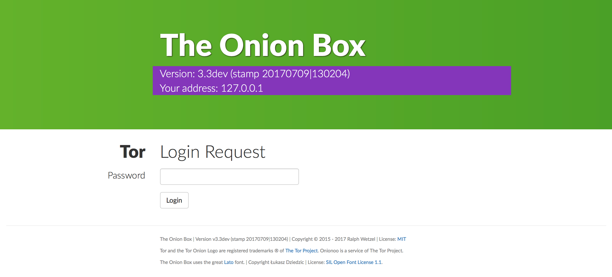


### No Authentication
There might be situations, where access control to the ControlPort is not demanded or even obstructive.
In that case it may be necessary to explicitely turn off _Cookie Authentication_ in your `torrc` - as it might be enabled by default:
```
CookieAuthentication 0
```

## Advanced Operations: Control Interface
Monitoring a Tor node in the end just demands two prerequisites: Access to an interface to control the node and a way to authenticate against the node. Therefore _Advanced Operations_ is all about the different ways to provide a **control interface** and the different ways of [authentication](#advanced-operations-authentication) .

### Caution
On Unix or Unix-like systems it is preferred to use a `ControlSocket` rather than a `ControlPort` as interface to the control port of a local Tor node.

Providing a socket ensures that only a process local to the system is able to connect.

If you mis-configure a `ControlPort`, you might endanger the security of your system; if you mis-configure a `ControlSocket`, you just cannot connect.

### ControlSocket
By default (defined in the configuration file [`torrc.default`](#configuration)) a Tor node offers a `ControlSocket` as standard controlling interface (at least on Unix and Unix-like systems). This default socket is e.g. defined as `/var/run/tor/control`.

A `ControlSocket` can only been accessed locally; therefore you need to install _The Onion Box_ on the same system that hosts the Tor node you intend to monitor.
To access a `ControlSocket` the process trying to connect needs to have the correct privileges. This can be achieved most easily by running your box as the same user as the Tor node (which e.g. is _debian-tor_ on Debian systems): `sudo -u debian-tor python theonionbox.py`

To instruct your box to connect to a local ControlSocket define the following parameters:
```
[Tor]
control = socket
socket = /var/run/tor/control
```

You can use the same parameter language - if applicable - in `[TorProxy]` or when defining the connection settings of a _Controlled Host_.

### ControlPort
Configuring a `ControlPort` as controlling interface for a Tor node is as simple as defining
```
ControlPort 9051
```
into the node's `torrc` file - and restarting Tor. Almost every _Beginner's guide to setup a Tor relay_ explains how to achieve this.

To instruct _The Onion Box_ to connect to a `ControlPort` interface, you have to define two parameters, the `host` and the `port`.

> A `ControlPort` - in the sense of this documentation - is **not** a `unix://path` unix domain socket definition yet only a port number according to internet protocol specification. If you intend to operate with an unix domain socket interface, follow the instructions in the chapter [ControlSocket](#controlsocket) - even if you've defined that socket in `torrc` with parameter `ControlPort`.

`host` can be either an IP4-address or a hostname.
> `host` definition via IP6 address currently is not supported.

`port` has to be a number in the standard range of port numbers between 0 and 65535.

Thus use the following language in your box' configuration file to instruct it to connect to a ControlPort:
```
[Tor]
control = port
host = 127.0.0.1
port = 9051
```

You may use `control=port` to connect to local (`host=127.0.0.1`) or remote (`host=www.my.torserver.com`) Tor nodes.

You can use the same parameter language - if applicable - in `[TheOnionBox]`, `[TorProxy]` or when defining the connection settings of a _Controlled Host_.

### ControlPort via Proxy
You can instruct your box to connect to a remote host via the Tor network. Prerequisite for such an operation is the definition and availability of a Tor node as proxy server:

> You can enable a Tor node's `socks` proxy capabilities by defining a `SocksPort` in `torrc` - and restarting Tor.

Use the following language in your box' configuration file to instruct it to connect to the ControlPort of a Tor node via the Tor network:
```
[Tor]
control = proxy
host = www.my.torserver.com
port = 9051
```

Be aware that this kind of setup is only limited useful, as the monitoring traffic exits the Tor network at an exit node and circulates into the open internet until it reaches the Tor node to be monitored.

You yet can unfold the full potential of this feature if you use it with a Tor node providing access to it's controlling interface by a [hidden service](#hidden-service-operations).


## Hidden Service Operations
_The Onion Box_ supports remote monitoring of a Tor node via the Tor notwork services. While it might be a bit more effort to set up such a connection, it provides the advantage that the whole traffic circulates only within the Tor eco system; there is no footprint of the monitoring activity in the open internet, adding a further layer of security to your operations.

### Basic configuration
To create that kind of connection, you have to prepare a hidden service that allows connection to the ControlPort of the Tor node to be monitored - by adding
```
HiddenServiceDir /var/lib/tor/theonionbox/
HiddenServicePort 9876 /var/run/tor/control
```
to this node's `torrc`.  
The first parameter of `HiddenServicePort` is the virtual ControlPort we'll connect to later.  
The second parameter of `HiddenServicePort` is the local controlling interface of the node - which might be a `ControlSocket` (as in the example shown) or a `ControlPort` (like `127.0.0.1:9051`).

After a restart of the Tor node by `sudo service tor restart`, you will find the onion address of your Hidden Service in `<HiddenServiceDir>/hostname`. The address usually is a 16 character string followed by `.onion`, e.g. _7an5onionad2res2.onion_.

To monitor this Tor node, add a dedicated section to the configuration file of your box.
```
[MyProxyNode]
control=proxy
host=7an5onionad2res2.onion
port=9876
```
Provide as `host` parameter the onion address of your hidden service, as `port` the virtual ControlPort number you defined in the node's `torrc`.

This node will then be listed as a _Controlled Host_ in the [Control Center](#control-center) section of the web interface.

### Access control

As this Hidden Service configuration exposes the ControlPort of your Tor node to everyone who is able to connect to a Hidden Service, you have to consider a way to control the access to prevent misuse.

The first option is to enable [_Password Authentication_](#password-authentication) on the Tor node monitored.

Alternatively you could take advantage of Tor's _Hidden Service Client Authorization_ feature. In short, it restricts access to the Hidden Service to those clients that are able to provide the correct _Authorization Cookie_.

To enable this feature, edit again your Tor node's `torrc`. Alter the Hidden Service section to
```
HiddenServiceDir /var/lib/tor/theonionbox/
HiddenServicePort 9876 /var/run/tor/control
HiddenServiceAuthorizeClient stealth myBoxConnector
```
The second parameter of `HiddenServiceAuthorizeClient` is the **unique** username you intend to use to operate this connection.
> Please do **not** use _myBoxConnector_ as in the example above; this term definitely is no more _unique_ and therefore quite unsuitable to secure your connection!

After another restart of Tor via `sudo service tor restart`, you will find the authorization cookie for the given username in `<HiddenServiceDir>/hostname`.  
Take this cookie - a 22 character string, e.g. _xa3NyourCookY6herexTOB_ - and add it to the settings you defined for this connection in the configuration file of your box:
```
[MyProxyNode]
control=proxy
host=7an5onionad2res2.onion
port=9876
cookie=xa3NyourCookY6herexTOB
```
Your box will ensure that the configuration cookie will be registered prior to a connection attempt.

As this procedure limits the use of the Hidden Service - and thus the access to the control port of the node - to only those (trusted) users that are able to provide the right authorization cookie, you might consider switching off the standard authentication functionality of the node's control port via it's `torrc`:
```
CoookieAuthentication 0
# HashedControlPassword
```

## _The Onion Box_ as system service (aka daemon)
After you've ensured that your box operates without issues, you can set it up to operate as a background application, which is the same as a system service or daemon. The steps to perform this differ depending on the technology used by your operating system derivate.

### Logging to syslog
When operating as a service, The Onion Box emits messages per default to [syslog](https://en.wikipedia.org/wiki/Syslog). To read those messages, which are usually saved to `/var/log/syslog`, use e.g. `tail`:
```
~ $ tail -n 100 /var/log/syslog | grep theonionbox
Feb 12 17:54:49 raspberrypi theonionbox[15716]: The Onion Box: WebInterface to monitor Tor node operations.
Feb 12 17:54:49 raspberrypi theonionbox[15716]: Version v4.2.xx (stamp 201802dd|hhmmss)
Feb 12 17:54:49 raspberrypi theonionbox[15716]: Running on a Linux host.
Feb 12 17:54:49 raspberrypi theonionbox[15716]: Running with permissions of user 'debian-tor'.
Feb 12 17:54:49 raspberrypi theonionbox[15716]: Python version is 2.7.13 (/home/pi/theonionbox/bin/python).
Feb 12 17:54:49 raspberrypi theonionbox[15716]: No (valid) configuration file found; operating with default settings.
Feb 12 17:54:53 raspberrypi theonionbox[15716]: Temperature sensor information located in file system. Expect to get a chart!
Feb 12 17:54:53 raspberrypi theonionbox[15716]: Uptime information located. Expect to get a readout!
Feb 12 17:54:58 raspberrypi theonionbox[15716]: Ready to listen on http://127.0.0.1:8080/
~ $
```
> Piping the `tail` output to `grep` allows you to get just the lines you're interested in, in our scenario those mentioning `theonionbox`.
> The `-n` command line parameter of `tail` limits the output to the number of lines defined.

If you are interested in your box sending the same messages additionally to a dedicated log file, you may enable this feature via a [command line parameter](#command-line-parameters).

### Optional syslog configuration
As stated above, the messages your box emits are (always) saved to `/var/log/syslog` - and mingled there with a multitude of messages from other programs running. You yet can easily configure syslog to put them as well in a seperate file (e.g. `/var/log/theonionbox.log`) and advise to rotate this file continously (which allows you e.g. to keep the size of the file(s) under control):

Append the following line at the end of the syslog configuration file `/etc/rsyslog.conf`:
```
:programname,isequal,"theonionbox"         /var/log/theonionbox.log
```
and restart the syslog daemon:
```
(theonionbox) ~/theonionbox $ sudo systemctl restart rsyslog
(theonionbox) ~/theonionbox $
```
To establish the rotation of `/var/log/theonionbox.log`, create a configuration file with the following content as `/etc/logrotate.d/theonionbox`:

```
/var/log/theonionbox.log { 
    daily
    rotate 5
    compress
    delaycompress
    missingok
    postrotate
        systemctl restart rsyslog > /dev/null
        # invoke-rc.d rsyslog reload > /dev/null  
    endscript    
}
```
This will rotate the files daily (at midnight), keep five (5) files and compress them as necessary.

> The `postrotate` command has to be adapted to the way your operating system uses to restart a background process (aka daemon). `systemctl ...` is for _systemd_ operations, `invoke-rc.d` to be used with _init.d_ / _SysVInit_ systems. Check [this site](https://unix.stackexchange.com/questions/18209/detect-init-system-using-the-shell) if unsure...

If a quick test of your setup ...
```
(theonionbox) ~/theonionbox $ logrotate -d /etc/logrotate.d/theonionbox
reading config file /etc/logrotate.d/theonionbox
Reading state from file: /var/lib/logrotate/status
Allocating hash table for state file, size 64 entries
Creating new state
[...]

Handling 1 logs

rotating pattern: /var/log/theonionbox.log  after 1 days (5 rotations)
empty log files are rotated, old logs are removed
considering log /var/log/theonionbox.log
Creating new state
  Now: 2018-02-14 09:30
  Last rotated at 2018-02-14 09:00
  log does not need rotating (log has been already rotated)
(theonionbox) ~/theonionbox $
```
... shows no errors, you may force `logrotate` once to run the rotation...
```
(theonionbox) ~/theonionbox $ sudo logrotate --force /etc/logrotate.d/theonionbox
(theonionbox) ~/theonionbox $
```
... to assure everything works as intended - and you're done.

### Prepared launcher scripts
If you followed the [installation procedure](#installation), the following directory structure was created in your virtual environment:
```
(theonionbox) ~/theonionbox $ ls -l
total 668
drwxr-xr-x 2 pi pi   4096 Jan 18 19:37 bin
drwxr-xr-x 2 pi pi   4096 Jan 18 19:37 config
drwxr-xr-x 3 pi pi   4096 Jan 18 19:37 docs
drwxr-xr-x 2 pi pi   4096 Jan 18 19:21 include
drwxr-xr-x 3 pi pi   4096 Jan 18 19:21 lib
-rw-r--r-- 1 pi pi     60 Jan 18 19:21 pip-selfcheck.json
-rw-r--r-- 1 pi pi 650924 Jan 18 19:37 README.html
drwxr-xr-x 5 pi pi   4096 Jan 18 19:37 service
(theonionbox) ~/theonionbox $ 
```
As already mentioned, the scripts prepared to run a box as system service are provided in `service`:
```
(theonionbox) ~/theonionbox $ cd service/
(theonionbox) ~/theonionbox/service $ ls -l
insgesamt 12
drwxr-xr-x 2 pi pi 4096 Feb 12 08:23 FreeBSD
drwxr-xr-x 2 pi pi 4096 Feb 12 08:23 init.d
drwxr-xr-x 2 pi pi 4096 Feb 12 08:23 systemd
```
The next steps differ based on your operating system:
* For FreeBSD, continue with the [next chapter](#-on-freebsd) .
* For systems using _SystemV_, jump forward to the section detailing [init.d](#-using-initd).
* For systems using _systemd_, go to the [systemd](#-using-systemd) section.
* If you're using another operating system: There's currently _no support_ to run The Onion Box as a service. This yet _does not mean it's impossible_. If you managed to setup such a configuration, drop me a line to implement a procedure here!

> Some hints:  
> A) Your system is operating with _systemd_, if the directory `/run/systemd/system` exists.  
> B) If you're really unsure: [This site](https://unix.stackexchange.com/questions/18209/detect-init-system-using-the-shell) provides some means to detect (or identify) the initialisation method used by your system.


### ... on FreeBSD
Let's assume, you've created the virtual environment for your _Onion Box_ at `/usr/home/pi/theonionbox`.

* Change to that directory: `cd /usr/home/pi/theonionbox`
* Change to the `FreeBSD` directory within `service`: `cd service/FreeBSD`
* Within this directory you'll find the script [`theonionbox.sh`](https://github.com/ralphwetzel/theonionbox/blob/master/FreeBSD/theonionbox.sh) prepared to launch your OnionBox as a background service.
* Ensure that you set the path to the OnionBox files and the user to run the service as intended. Therefore open the file with an editor (here we use _nano_): `nano theonionbox.sh`
* According to our assumptions above, set line 31 to `: ${theonionbox_dir="/usr/home/pi/theonionbox"}`.
* If necessary, you may define commandline arguments via `${theonionbox_start_args}` (as shown in the examples around line 35)
* Close _nano_ and save the changes to `theonionbox.sh`. (Press _Strg+X_ then follow the instructions given!)
* Copy the altered init script to `/usr/local/etc/rc.d`: `sudo cp ./theonionbox.sh /usr/local/etc/rc.d/theonionbox`
* Change to `/usr/local/etc/rc.d`: `cd /usr/local/etc/rc.d`
* Make sure the script you've copied before to `/usr/local/etc/rc.d` is executable: `sudo chmod 755 ./theonionbox`
* Register this service to the system: `sudo echo 'theonionbox_enable="YES"' >>/etc/rc.conf`
* Alternatively - e.g. if the former command failed - you may alter `/etc/rc.conf` directly: `sudo nano /etc/rc.conf`, append `theonionbox_enable="YES"` at the end of the file and save the changes: Press _Strg+X_ then follow the instructions given!
* Check that everything works so far: Launch your Onion Box for the first time as a service `sudo service theonionbox start`. This should give you no error messages.
* Check that your Onion Box is active: `sudo service theonionbox status` should tell you `theonionbox is running as pid xxx.`
* That's it! Next time you reboot your system, your _Onion Box_ will be relaunched as well.

**Troubleshooting**
* Please ensure that `/usr/sbin/daemon` is a valid path. If not either edit `/usr/local/etc/rc.d/theonionbox` line 49 or create a symbolic link to your installation's path to `daemon` as `/usr/sbin/daemon`.
* `command_interpreter` shall point to the python executable within your virtual environment.


### ... using init.d
Change to the `init.d` directory within `service`:
```
(theonionbox) ~/theonionbox/service $ cd init.d/
(theonionbox) ~/theonionbox/service/init.d $ ls
theonionbox.sh
```
The launcher script is `theonionbox.sh`. Open it with a text editor to adapt it to your installation. We're using `nano` here:
```
(theonionbox) ~/theonionbox/service/init.d $ nano theonionbox.sh
```
These are the first lines of `theonionbox.sh` - those relevant for configuration:

```bash
#!/bin/bash

#####
# This script is based on a great tutorial of SC Phillips
# http://blog.scphillips.com/posts/2013/07/getting-a-python-script-to-run-in-the-background-as-a-service-on-boot/
#


### BEGIN INIT INFO
# Provides:          theonionbox
# Required-Start:    $remote_fs $syslog
# Required-Stop:     $remote_fs $syslog
# Default-Start:     2 3 4 5
# Default-Stop:      0 1 6
# Short-Description: The Onion Box: WebInterface to monitor Tor node operations
# Description:       http://www.theonionbox.com
### END INIT INFO

# Adapt this to provide the path to the root directory of the virtual environment you created for your box
DIR=/the/path/to/your/virtual_env
# usually no need to change the next two lines!
DAEMON=$DIR/bin/theonionbox
DAEMON_NAME=theonionbox

# This next line determines what user the script runs as.
DAEMON_USER=debian-tor

# Add any command line options for your daemon here:
# If you e.g. want your box to create additional log files, enable this here!
# DAEMON_OPTS="--log=$DIR"
# HeadsUp! You then have to ensure that DAEMON_USER has write privileges to $DIR!
DAEMON_OPTS=""

#####
# *** No need to change anything below this line! ***
#
[...]
```
Alter the line starting with `DIR=` to provide the path to the root directory of the virtual environment you created for your box. For our scenario, this is `/home/pi/theonionbox`:
```bash
[...]
# Adapt this to provide the path to the root directory of the virtual environment you created for your box
DIR=/home/pi/theonionbox
# usually no need to change the next lines!
[...]
```
Next you should verify that `DAEMON_USER=` is naming the _correct_ user to run your Onion Box. On Debian, this is usually `debian-tor` and thus already set accordingly.
```bash
[...]
# This next line determines what user the script runs as.
DAEMON_USER=debian-tor
[...]
```
> Refer to the chapter [First Flight](#first-flight) if you're unsure what to use here.

Finally there is `DAEMON_OPTS=` to provide command line parameters to the launching script - if you need those.
```bash
[...]
# Add any command line options for your daemon here:
# If you e.g. want your box to create additional log files, enable this here!
# DAEMON_OPTS="--log=$DIR"
# HeadsUp! You then have to ensure that DAEMON_USER has write privileges to $DIR!
DAEMON_OPTS=""
[...]
```
Refer to the chapter discussing the [command line parameters](#command-line-parameters) for details.

That completed, close `nano` and save the changes to `theonionbox.sh`: Press _Strg+X_, then follow the instructions given!

The next steps are straight forward:
* Copy the altered init script to `/etc/init.d`: `sudo cp ./theonionbox.sh /etc/init.d`
* Change to `/etc/init.d`: `cd /etc/init.d`
* Make sure the script you've copied before to `/etc/init.d` is executable: `sudo chmod 755 ./theonionbox.sh`
* Register this service to the system: `sudo systemctl daemon-reload`
* Check that everything works so far: Launch your Onion Box for the first time as a service `sudo ./theonionbox.sh start`. This should give you no error messages but feedback a nice \[OK\].
* Check that your Onion Box is active: `sudo ./theonionbox.sh status` should tell you `active (running)`.
* Finally run `sudo update-rc.d theonionbox.sh defaults` to link `theonionbox.sh` into `init.d`'s default launch sequence.

Done.


### ... using systemd
Change to the `systemd` directory within `service`:
```
(theonionbox) ~/theonionbox/service $ cd systemd/
(theonionbox) ~/theonionbox/service/systemd $ ls
theonionbox.service
```
The launcher script is `theonionbox.service`. Open it with a text editor to adapt it to your installation. We're using `nano` here:
```
(theonionbox) ~/theonionbox/service/systemd $ nano theonionbox.service
```
This is `theonionbox.service` - in full length:
``` bash
# Based on a contribution by svengo
# https://github.com/ralphwetzel/theonionbox/issues/24

# Run The Onion Box as background service
# https://github.com/ralphwetzel/theonionbox/

[Unit]
Description=The Onion Box
Documentation=https://github.com/ralphwetzel/theonionbox
After=network.target

[Service]
Type=simple
WorkingDirectory=/home/pi/theonionbox
ExecStart=/home/pi/theonionbox/bin/theonionbox
User=debian-tor
SyslogIdentifier=theonionbox
StandardOutput=syslog
StandardError=syslog
Restart=on-failure
RestartSec=10

[Install]
WantedBy=multi-user.target
```
Alter the line starting with `WorkingDirectory=` to provide the absolute path to the root directory of the virtual environment you created for your box. For our scenario, this is `/home/pi/theonionbox`:
```bash
[...]
WorkingDirectory=/home/pi/theonionbox
[...]
```
Next provide the (absolute) path to [_The Box Launcher_](#verification-of-the-installation) to parameter `ExecStart=`. This path usually is a concatenation of the path already defined for `WorkingDirectory=` (which names the root directory of the virtual environment of your box) and `bin/theonionbox`:
```bash
[...]
ExecStart=/home/pi/theonionbox/bin/theonionbox
[...]
```
If you need to define [command line parameters](#command-line-parameters), append those as well to `ExecStart=`; e.g. to enable the Debug mode, add a `-d`:
```bash
[...]
ExecStart=/home/pi/theonionbox/bin/theonionbox -d
[...]
```
Finally you should verify that `User=` is naming the _correct_ user to run your Onion Box. On Debian, this is usually `debian-tor` and thus already set accordingly.
```bash
[...]
User=debian-tor
[...]
```
> Refer to the chapter [First Flight](#first-flight) if you're unsure what to use here.

That completed, close `nano` and save the changes to `theonionbox.service`: Press _Strg+X_, then follow the instructions given!

The next steps are straight forward:
* Copy the altered script to `/etc/systemd/system`: `sudo cp ./theonionbox.service /etc/systemd/system`
* Start the new service with `sudo systemctl start theonionbox`
* Check that your Onion Box is active: `systemctl status theonionbox` should tell you `active (running)`.
* If everything is okay, link `theonionbox.service` into `systemd`'s start sequence to auto-launch it when booting the system: `sudo systemctl enable theonionbox`.

Done.

## *The Onion Box* behind Apache's mod_proxy

If you intend to operate your *Box* behind Apache's *mod_proxy*, you need to adapt the configuration of both, the proxy as well as your *Box*:

For the following example lets assume that your *Onion Box* is at `192.168.178.46:8080` in your local (home) network.
You're logged into the server acting as the proxy. Apache is already installed on this server.

To configure *mod_proxy* edit the configuration file `httpd.conf` and uncomment the following lines:
```
LoadModule proxy_module modules/mod_proxy.so 
LoadModule proxy_ajp_module modules/mod_proxy_ajp.so 
LoadModule proxy_http_module modules/mod_proxy_http.so
```

At the end of `httpd.conf` add the following line to define the proxy operation:

```
ProxyPass <proxyname> <endpointURL>
```

Regarding our example you would define
```
ProxyPass "/theonionbox" "http://192.168.178.46:8080"
```

After a restart of Apache, browsing to `localhost/theonionbox` on your proxy server should then redirect to `http://192.168.178.46:8080`.
Doing so should open your *Box* page - yet it looks scrumbled and doesn't operate as it should.

To solve that issue you have to set the parameter `base_path` in your `theonionbox.cfg` configuration file to match the `<proxyname>` you defined earlier:

```
# Per default, the Box operates at the root level of a domain e.g. http://localhost:8080/.
# If you intend to operate it (behind a proxy!) at a deeper level (e.g. @ http://my.server.com/theonionbox/)
# you have to define that base path here. You are not limited to a single path element.
# Please assure that this is an absolute filepath yet without the domain:port, beginning with a leading slash,
# no trailing slash, no quotation marks:
base_path = /theonionbox
```
Now everything should work as expected.

## *The Onion Box* Docker support
The [Docker](Docker) directory holds a [Dockerfile](https://docs.docker.com/engine/reference/builder/) and a dedicated configuration file (`theonionbox.cfg`) to support the operation of *The Onion Box* from a [Docker](http://www.docker.com) image. Please be aware, that this Docker image for *The Onion Box* only supports [password authentication](#password-authentication).

To build the image, change to the Docker directory and run `sudo docker build -t theonionbox .`.
> If you've run `pip` to perform the [installation](#installation) of your Onion Box, you'll find the Docker directory within the [`service`](#verification-of-the-installation) directory.

To then launch *The Onion Box* within the created Docker image, run `sudo docker run --network host -p 8080:8080 theonionbox`.


## Usage Monitoring
To create a small survey of its usage, _The Onion Box_ sends the following information to `t527moy64zwxsfhb.onion`, the hidden service acting as _The Onion Box Update Service_ when requesting the latest version information of Tor and _The Onion Box_:

- An UUID created newly each time during launch of the box.
- The stamp of your _Box_ release
- The name of the operating system hosting your box
- The release information of the operating system hosting your box

By intension these information are not at all sufficient to identify you (as a person) or the system hosting your box. They just allow to estimate the number of concurrently running instances of _The Onion Box_ and the diversity of the underlying operating systems.

Please refer to [version.py](theonionbox/tob/version.py) to review the code:
```python
[...]

proxies = {
    'http': 'socks5h://' + proxy_address,
    'https': 'socks5h://' + proxy_address
}
payload = {
    'protocol': __VERSION_PROTOCOL__,
    'version': self.version,
    'system': self.system,
    'release': self.release
}

address = 'http://t527moy64zwxsfhb.onion/{}/check.html'.format(self.id)

r = None

try:
    r = requests.get(address, proxies=proxies, params=payload, timeout=10)
except Exception as exc:
    pass

[...]

```

## Q&A
### I receive a _Not supported proxy scheme socks5h_ warning. What shall I do?
If you receive this message, your `requests` module installation most probably is outdated - and not supporting _socks5h_ proxy operations.

If you do the obvious thing and try to `pip install requests --upgrade`, you risk to destroy your `pip` functionality.

Therefore you should first  
`sudo easy_install -U pip` (Python 2.x)  
or  
`sudo easy_install3 -U pip` (Python 3.x)
to install the latest `pip` version **together with a very recent version of `requests`**.

> This works even if your `pip` installation is already broken and issuing e.g. an _IncompleteRead_ error.

After that, you could `pip install requests --upgrade` if you like, yet usually it shouldn't be necessary any more.

### I get a _Memory Error_ when trying to install via pip

If your system answers a `pip install theonionbox` command with a lengthy error message ending like
```
[...]
File "/usr/local/lib/python2.7/dist-packages/pip/_vendor/cachecontrol/controller.py", line 205, in cache_response
self.serializer.dumps(request, response, body=body),
File "/usr/local/lib/python2.7/dist-packages/pip/_vendor/cachecontrol/serialize.py", line 81, in dumps
).encode("utf8"),
MemoryError"
```
it is time to reboot your system.  
If the problem still persists after the reboot, you could try to perform the installation process via
```
pip --no-cache-dir install theonionbox
```
to reduce the memory demand of `pip` when installing _The Onion Box_.

## Shorttrack
The straightest procedure to run _The Onion Box_, if the `sudo` system is installed and the Tor node is owned by user `debian-tor`:

- `sudo useradd -m user1`
- `sudo passwd user1`; enter password
- `sudo usermod -s /bin/bash user1`
- to be safe: `sudo usermod -g users user1`
- `sudo usermod -g sudo user1` grants `sudo` rights
- `su - user1`; enter password
- `virtualenv -p python3 theonionbox`
- `cd theonionbox`
- `source bin/activate`
- `pip install theonionbox`
- `sudo -u debian-tor bin/theonionbox`; enter password

Enjoy!

## Acknowledgments
Day by day it is a repetitive pleasure to learn from uncountable people who share their knowledge, their time and their work with the world. This section shall express my gratefulness to those who supported me solving issues I encountered during the last years. **Thank You!**

Łukasz Dziedzic (and his friends) - for creating and publishing the great [Lato](https://latofonts.com) font family.

[SC. Phillips](http://www.scphillips.com) - whose [Blog](http://blog.scphillips.com/posts/2013/07/getting-a-python-script-to-run-in-the-background-as-a-service-on-boot/) gave a perfect starting point when I tried to operate _The Onion Box_ as a background service.

All the people contributing to [StackOverflow](https://stackoverflow.com/) - who taught me Python by example.

[svengo](https://github.com/svengo) - who [contributed](https://github.com/ralphwetzel/theonionbox/issues/24) the [procedure](#-using-systemd) to operate _The Onion Box_ as a daemon with systemd.

<table>
  <tbody>
    <tr >
    <td width = "100px">
    
    </td>
    <td>

The [JetBrains](http://www.jetbrains.com) team - for their support to _The Onion Box_ providing an Open Source license of their gorgeous PyCharm IDE. If you run your own personal Open Source project, you may as well apply for a license [here](https://www.jetbrains.com/buy/opensource/?product=pycharm) (non affiliated link).
</td>
</tr>
  </tbody>
</table>

Olaf - who provided great support and endless patience while testing the `pip` installation system and its dedicated documentation.

[Rupert Edwards](https://github.com/ruped24) - who contributed the Docker support setup.

> I apologize sincerely being convinced it is impossible to mention everyone who gave me the opportunity to participate from his or her experience.  
Please raise your hand if you think someone should be added to this list!
